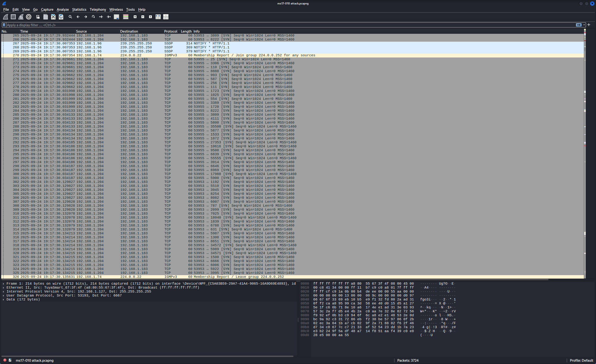
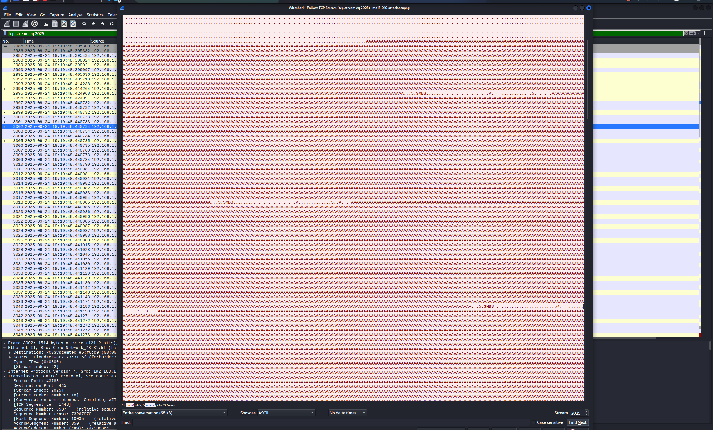

# Buffer-Overflow MS17-010
## Sandbox
- Virtualbox 
- Windows 7

## Tools
- Wireshark 
- Nmap 
- Metasplots

# pcap analysis
## Scanning
There are constantly Syn packets being sent to different ports, which shows that someone is scanning our system.

## Attack
Realizing there is an abnormality in the SMB protocol, when checking the packets, we see a long string containing a series of A characters, this shows that the hacker is attacking by exploiting the Buffer Overflow error.
